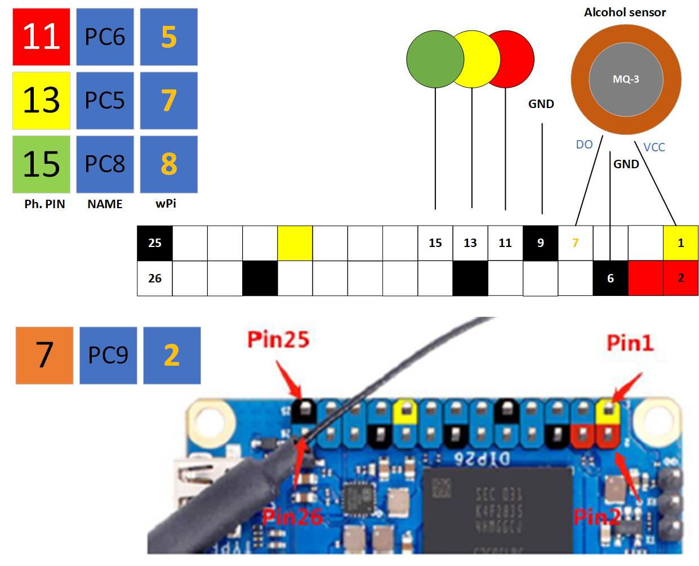

# Alcohol Detection System with Orange Pi using MQ-3 Sensor

This project demonstrates how to use a Orange Pi along with an MQ-3 alcohol sensor to detect the presence of alcohol in the air. The system uses LEDs to indicate the presence or absence of alcohol.

## Requirements

- Orange Pi
- MQ-3 Alcohol Sensor
- LEDs (Red and Green)
- Jumper wires

## Circuit Diagram



## Installation

1. Ensure you have WiringOP library installed on your Orange Pi.
2. Connect the components as per the circuit diagram.
3. Compile the C++ code provided using the following command:
    ```
    g++ -o mq3-sensor mq3-sensor.cpp -lwiringPi
    ```
4. Run the compiled program:
    ```
    ./alcohol_detection
    ```

## Usage

- The program continuously reads the digital output from the MQ-3 alcohol sensor connected to pin 2 (`MQ3_PIN`).
- If alcohol is detected, the red LED connected to pin 5 (`RED_PIN`) will light up, and the green LED connected to pin 8 (`GREEN_PIN`) will turn off.
- If no alcohol is detected, the green LED will light up, and the red LED will turn off.

## Contributions

Contributions to improve this project are welcome! Please fork the repository and submit a pull request with your changes.

## License

This project is licensed under the MIT License - see the [LICENSE](LICENSE) file for details.
